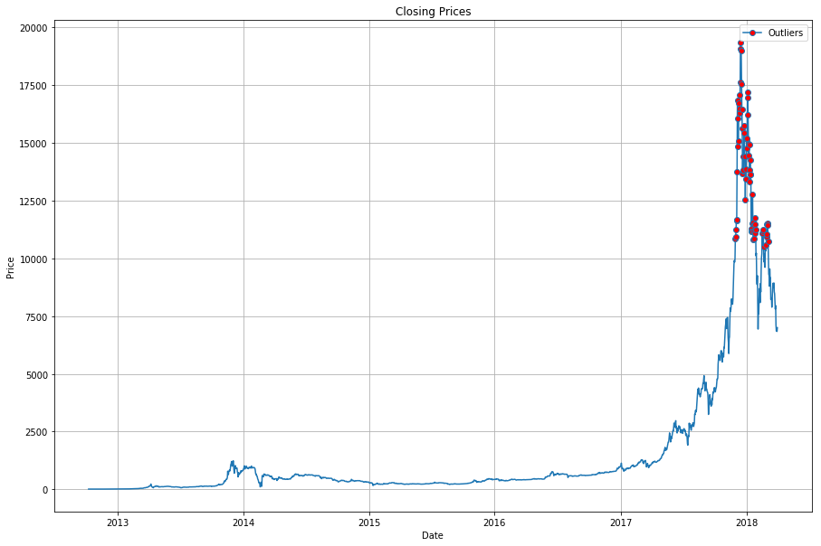
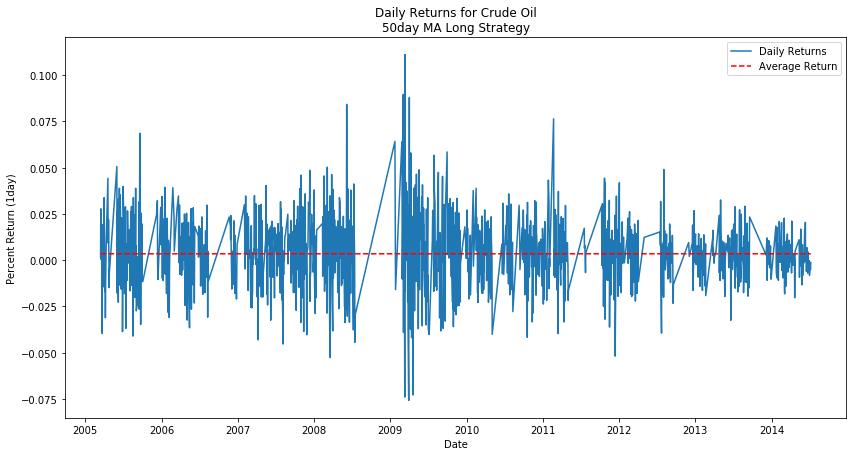

# Price_Indicator_Analysis (MVP)

Analysis of common technical analysis indicators on daily price data for different products.

## Goals

This analysis is being done to explore whether or not certain technical analysis indicators can consistently predict future price movements in various actively traded products.  Three common trading strategies include trend-following, break-out, and mean-reversion.  This project will explore indicators in each category and determine their individual predictive value over different timeframes.

## Data Collection

In order to get data from more traditional products and newer assets, I will be extracting data from both Quandl and Cryptocompare.  Each has its own API that is freely available, Quandl even has a package to be used specifically with Python.  For this project I am going to focus on historical daily price data, including the basis open, high, low, and close price as well as volume.  The end goal for collection is to have a database schema setup with three tables, one for Data source, one for Product names, and one for Price Data.  These tables will be linked by keys and include the relevant price and volume information mentioned above.

From Quandl, I want to look at data from highly traded products across different asset classes.  My breakdown follows...

  * **Grains**
       * Corn
       * Wheat
       * Soybeans
  * **Energy**
       * Crude Oil
       * Heating Oil
       * Natural Gas
  * **Forex**
       * Australian Dollar
       * Canadien Dollar
       * Euro
       * Japanese Yen
       * British Pound
  * **Treasuries**
       * 30-yr Bond
  * **Metals**
       * Gold
       * Silver
  * **Index**
       * E-mini S&P 500

Then in order to incorporate a newer asset class like cryptocurrencies I will use the Cryptocompare API.  I will look at the following 10 for this project, based on them being the current top 10 as far as market cap.

  * **Cryptocurrencies**
       * Bitcoin
       * Ethereum
       * Ripple
       * BitcoinCash
       * Litecoin
       * Cardano
       * Neo
       * Stellar
       * EOS
       * Monero

Here is the schema for the SQL database for storing the data locally.

**Data**     ---------->    **Symbols**     ------------->  **Daily_Prices**

## Data Cleaning

After examining the initial data I found there are a few different key areas of focus as far as cleaning the data.  

First of all, regarding the cryptocurrency data, due to the fact that each asset began trading at a different time, but we collected 2,000 data points for each, there are a lot of **zero** values.  

To clean this up and also take a look at data from times where there was enough liquidity to actually trade, I decided to pick a start date for each set of cryptocurrency to be the first day that trading volume reached **$1,000,000 USD**.

The next thing I noticed that needed to be addressed was certain days where volume was unlikely to be reported correctly.  There were alot of zero and low number values, considering the goal was to only look at highly liquid products.

This is likely due to poor data or something to do with the way they create the continuous contract, by taking weighting of the two current front months.  For this project **volume** is only going to be used in the case of a break-out strategy where we need to find days that are **200% of the rolling average volume**.  Thus, for our purposes taking these likely incorrect data and simply replacing them with the mean will suffice.

The last thing to do as far as cleaning the data before entering it into the database was to write a function that could check for outliers in price.  The fact is that these 3+ std moves do happen in commodity markets so my thought was to create a price chart and highlight the big outliers.

By looking at the entire price chart it should be easy to tell if the outlier was because of faulty data or simply because the market had made a big move so price was seriously deviating from the overall long-term mean.

Here is an example of the Crude Oil outliers

And this is the Bitcoin outliers chart

Each market has its outliers but they were due to the market itself making a strong move away from the mean value for the entire time series.  This is not uncommon for commodities and cryptocurrencies.  

In looking at the chart and having experience with these products I am comfortable saying that none of the points are far off due to inaccurate data.

## Data Manipulation

The next step in the analysis is to add columns to each product's dataframe to represent the specific indicators that we are interested in observing.  These can all be calculated from the current, **open, high, low, close, volume** data that we have.  

We also want to add columns that track future price changes.  I am choosing to look at a few different time frames, next day, 5 days out, 10 days out, and 20 days out.  Once we have columns for each indicator as a binary (0 if no signal, 1 if signal) and columns for the future returns from that point we can analyze which (if any) of the indicators shows promise for consistently predicting future returns.

Here is a list of the trade signal columns, price change columns, and descriptions

##### Break-out Strategies
* **Volume Break-out** - identifies days that are at least 200% of the 20day moving average volume.  Then gives a long signal if the closing price is greater than the previous day's high, or a short signal if the close is less than the previous day's low.

* **Range Break-out** - identifies days that trade higher than the high of the previous 20 days (long signal) or lower than the low of that range (short signal).

##### Trend-following Strategy
* **20day Moving Aveage** - identifies if price is above or below the 20day moving average and gives a long or short signal depending on the side.

* **50day Moving Aveage** - identifies if price is above or below the 50day moving average and gives a long or short signal depending on the side.

* **100day Moving Aveage** - identifies if price is above or below the 100day moving average and gives a long or short signal depending on the side.

##### Mean-reversion Strategy
* **Bollinger Band** - identifies when price trades higher than 2 standard deviations above or lower than 2 standard deviations below the 20day moving average.  If above it gives a short signal, if below a long.

##### Future Price Movement
* **Percent Change after 1 day** - gives the percentage change in price from close of this day to close of 1 day into the future.

* **Percent Change after 5 days** - gives the percentage change in price from close of this day to close of 5 days into the future.

* **Percent Change after 10 days** - gives the percentage change in price from close of this day to close of 10 days into the future.

* **Percent Change after 20 days** - gives the percentage change in price from close of this day to close of 20 days into the future.

With these columns now appended to our dataframes we can take a look at the number of signals produced for each product.  Here is the breakdown for **Crude Oil**

And this is the breakdown for **Bitcoin**

## Initial Exploration

Now that we have all the data and indicators that we need, it is time to explore the real question at hand, do any of these indicators do a good job of predicting future prices.

In order to do this we will create a plot of the future returns of a product after each signal is triggered and see if the distribution is consistently around zero (no predictive value), above (positive predictive value), or below (negative predictive value).  Keep in mind that if we find an indicator that consistently predicts negative returns all we have to do is change the entry direction in order to create a winning strategy.

Here is an example with **Crude Oil** using the **50day Moving Average Long** strategy,looking at the **1day returns**.

And here looking at the **50day Moving Average Short** strategy, with **1day returns**.

So this looks like a good start.  With any trading strategy it is good to see positive results in each direction of trade.  It is a very simple way to show this is possibly a robust strategy, not one that finds winners in one direction but would just give back those gains on signals in the other direction.  

From here we will create a function to analyze this **signal-return** relationship for each signal, and for each timeframe of returns.  Then we will take a look at all the relationships to form hypotheses to test about what strategies are showing good predictive value.

In order to look at all the relationships I wrote a function to take in symbol, signal, and timeframe data and return the relevant statistics on percent returns.  Then I iterated over all products, for each signal, for each time period and added the data to a new dataframe.  It is this dataframe that I will use to show results of the initial exploration in the next section.

## Initial Research Findings

## Further Research and Analysis

1. **Different Timeframes**
2. **Futures contract consideration, rather than continuous**
3. **Better check for outliers, not just 3 stds from overall mean**
