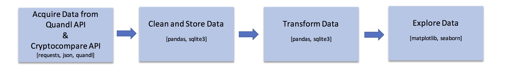

# Price_Indicator_Analysis

This project is the second for the K2 Data Science program.  In general it is going to encompass gathering current and historical price data for multiple products from different sources, cleaning and manipulating it into desired form, then analyzing it in order to see what conditions and/or indicators have the best predictive ability to future price movements.

# Project Organization
------------

    |-- README.md           <- The top-level README which serves as a run-through the project
    │
    ├── MVP                 <- Minimum Viable Product
    │   |__ images          <- Generated figures to be used in reporting
    |   |__ README.md       <- Run-through of the MVP
    |   |__ Price_Indicator_Analysis_MVP.ipynb
    |
    |-- figures             <- Collection of figures used in creating the walkthrough
    │
    ├── notebooks           <- Jupyter notebooks used to create scripts, perform data cleaning,
    |                         manipulation, visualizations, etc
    │
    └── src                 <- Source code for use in this project
        ├── __init__.py     <- Makes src a Python module
        │
        ├── data            <- Scripts to download or generate data
        │   |── db_setup.py
        |   |__ util.py
        │
        ├── manipulation    <- Scripts to manipulate data into desired form for analysis
        │   └── manipulation.py
        │
        ├── analysis        <- Scripts to summarize and analyze cleaned data
        |   |
        |   ├__ analysis.py
        |  
        |
        |__ visualization   <- Scripts to visualize the exploratory analysis
            |
            |__ visualization.py

--------

## Project Workflow

## Data

The data being used here is all historical data.  It has been pulled from a few different sources, in order to find
robust indicators for future price movements have significance regardless of underlying product.

For continuous futures data, [Quandl](https://www.quandl.com/collections/futures)
For cryptocurrency data, [Cryptocompare](https://www.cryptocompare.com/)
For stock data, [Quantopian](https://www.quantopian.com/data?type=free)

## Improvements

1. For all futures data, continuous contracts were used for simplicity.  This means that when the a contract expires,
there is a rolling period where an average of the old and new front month contract prices are used rather than the
actual price.  This is an issue with futures contracts in general and any real trading strategy back-testing would
need to account for this.  However, this analysis was done simply to find good candidates for indicators that predict
future prices.  Therefore, I do not think it would significantly affect this study, but would need to be kept in
mind when moving to the next level of implementation.

2. This data is all historical data.  When moving on to creating strategies and potentially trading them, there
would need to be functionality for updating data and making decisions based on what is happening right now. Also
this type of analysis would need to continue to run in order to determine if the best indicators are continuing to
work, or if there are new indicators that are working better given current situations.

1. **Different Timeframes**
2. **Futures contract consideration, rather than continuous**
3. **Better check for outliers, not just 3 stds from overall mean**
4. **Better testing and cleaning of data before deploying capital**
